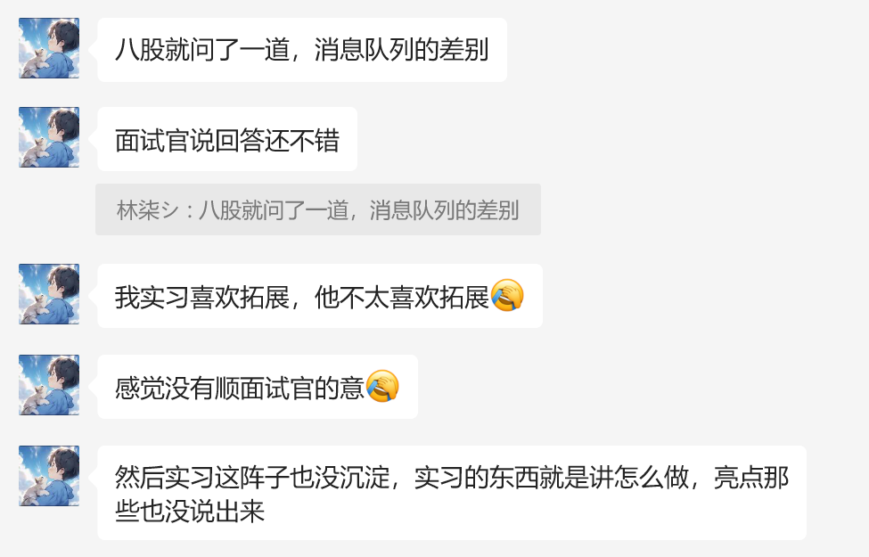

# 字节面经

# 背景信息
工作年限：25 届

面试轮次：1 面

时间 9.26

# 题目信息
实习拷打

1.pprof使用

2.敏感词过滤，AC自动机，trie树，kmp算法

3.MySQL优化(我扩展到lsm树了，这个就是最大的败笔，面试官听完什么都没说，直接过了)

4.请求折叠，Redis缓存(纯尬聊)

5.easyExcel百万数据导入导出

场景题

1.topk问题，数组很大，内存很小，找到最大的10个数，我脱口而出小顶堆，换了个难的

2.n个文件，存URL，找到两两之间的交集

算法

编辑距离(3分钟秒了)

反问环节

1.大模型在字节电商业务中的使用(ai助手以及开发)

2.ddd架构在字节应用广泛吗？(字节重快速开发，迭代上线，每个组架构和风格不同)

# 鸣谢
鸣谢答案哥真题提供

> 原文: <https://www.yuque.com/jingdianjichi/xyxdsi/mxz33s88bdoo1vp7>