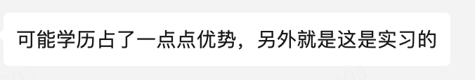
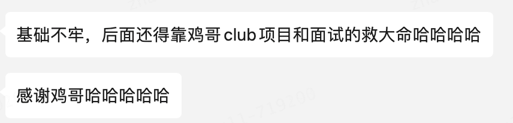

# 👌美团-应届-暑期实习

# 背景信息
工作年限：大三在校生

学校：西安交通大学

面试轮次：2 轮面试

## 一面
1、 首先就是自我介绍

[👌介绍一下自己吧？](https://www.yuque.com/jingdianjichi/xyxdsi/pfszpyzvh1vnqbf9)

2、 然后就是介绍一下项目（为了避免踩坑，立马澄清自己与微服务中其它东西的关系）

[👌介绍一下你做过的项目和技术栈](https://www.yuque.com/jingdianjichi/xyxdsi/hd79bfu1sfgehqzz)

3、 介绍一下RocketMQ，MQ一般用来干什么

[👌RabbitMQ基本概念有哪些？](https://www.yuque.com/jingdianjichi/xyxdsi/ie9zthf0se4hzgiz)

[👌MQ 使用场景有哪些？](https://www.yuque.com/jingdianjichi/xyxdsi/xwryds0a4r0gvpe6)

4、Java的线程池是什么，有什么作用

[👌介绍一下常用的java的线程池？](https://www.yuque.com/jingdianjichi/xyxdsi/zcuxm2pogymgs7g6)

[👌使用线程池的好处](https://www.yuque.com/jingdianjichi/xyxdsi/bz575xpsoxxah6na)

5、 介绍一下Java的数据结构

[👌介绍一下Java的数据结构](https://www.yuque.com/jingdianjichi/xyxdsi/qpdz3l69zdt38mw1)

6、MySQL的事务是什么，回答了ACID性质

[👌mysql事务的四大特性？](https://www.yuque.com/jingdianjichi/xyxdsi/kydkt5zebso4px4l)

7、 介绍一下MySQL的索引

[👌mysql的innodb和myisam索引的区别?](https://www.yuque.com/jingdianjichi/xyxdsi/buygigkcozhtx70q)

8、 介绍一下SpringBoot是什么

[👌什么是SpringBoot](https://www.yuque.com/jingdianjichi/xyxdsi/qhs58y0g02ks4ye7)

9、 介绍一下SpringCloud是什么（回答我只是学习用到了，并没有很深入地去学习它）

[👌SpringCloud是什么？](https://www.yuque.com/jingdianjichi/xyxdsi/gh1yice80ngd37al)

10、 简单地讲一下Paxos算法（脑子瓦特了，想不起来），然后就是解释一下CAP理论

[👌讲一下Paxos算法？](https://www.yuque.com/jingdianjichi/xyxdsi/gb85hubkpg1tg2ax)

[👌讲一下CAP理论？](https://www.yuque.com/jingdianjichi/xyxdsi/lxwx989qdnxfoks4)

11、 浏览器从输入一个地址开始发生了些什么

[👌从输入URL到显示网页期间发生了什么？](https://www.yuque.com/jingdianjichi/xyxdsi/pkh6upouoymw5hi4)

12、 算法题：重排链表

[. - 力扣（LeetCode）](https://leetcode.cn/problems/reorder-list/description/)

## 二面
1、 首先就是介绍一下项目。挑一个我感兴趣的来讲。介绍一下项目背景，评论的设计，表怎么设计的，优化的点在哪里

2、 有了解ThreadLocal吗。为什么弱引用会出问题

[👌ThreadLocal原理](https://www.yuque.com/jingdianjichi/xyxdsi/vmig344fhaluugtt)

[👌ThreadLocal的内存泄漏问题](https://www.yuque.com/jingdianjichi/xyxdsi/lbw9tlrpgewb1532)

3、 介绍一些Mysql的索引，联合索引的应用，几道索引使用题目，判断是否会用到索引

[👌mysql索引存储结构？](https://www.yuque.com/jingdianjichi/xyxdsi/fri0ce6bv2r2xm0d)

[👌唯一索引比普通索引快吗？](https://www.yuque.com/jingdianjichi/xyxdsi/lythniv17v2vt28t)

[👌A,B,C三个字段组成联合索引，AB,AC,BC三种情况下查询是否能命中索引？](https://www.yuque.com/jingdianjichi/xyxdsi/xbyg0idxybt2klr6)

4、mysql的隔离级别，每个隔离级别会产生什么影响

[👌Mysql的事务隔离级别?](https://www.yuque.com/jingdianjichi/xyxdsi/ge31ov5wqg3cyzsm)

[👌mysql不同事务隔离级别时都是什么锁？](https://www.yuque.com/jingdianjichi/xyxdsi/iz60aibgxn4lgowl)

5、 介绍一下Synchronied和RenntrantLock

[👌synchronized的底层实现？](https://www.yuque.com/jingdianjichi/xyxdsi/ix40pr6btxnuf20u)

[👌ReentrantLock的实现](https://www.yuque.com/jingdianjichi/xyxdsi/kk59x643km06y7rt)

6、redis是单线程还是多线程的，单线程的情况下删除一个大key会发生什么

[👌redis是单线程还是多线程的，单线程的情况下删除一个大key会发生什么？](https://www.yuque.com/jingdianjichi/xyxdsi/hf4lu7qlrra81bi5)

7、redis的过期策略了解吗

[👌redis过期策略有哪些？](https://www.yuque.com/jingdianjichi/xyxdsi/qvy56ukqsnfbyqno)

8、 介绍一下Redis的数据类型

[👌redis支持哪几种数据类型?](https://www.yuque.com/jingdianjichi/xyxdsi/xac8obblzuwh66a5)

[👌redis的高级数据类型有哪些？](https://www.yuque.com/jingdianjichi/xyxdsi/wfqkn5izd8q9lrp2)

9、 消息队列的作用是什么，在的项目里面，用它来干什么

[👌为什么要使用MQ？mq常见作用？](https://www.yuque.com/jingdianjichi/xyxdsi/sogbigp86705zk2w)

10、Try catch finally的使用

[👌Try catch finally的使用？](https://www.yuque.com/jingdianjichi/xyxdsi/iz0xcepes0f6xuk5)

11、 运行时异常和非运行时异常的区别是什么

[👌运行时异常和非运行时异常的区别是什么？](https://www.yuque.com/jingdianjichi/xyxdsi/yoa934u0qs7l5erv)

12、Java的基本数据类型有哪些

[👌Java有哪些数据类型？](https://www.yuque.com/jingdianjichi/xyxdsi/slkl8me8row8oax3)

13、mysql的MVCC了解过吗

[👌mvcc是什么？](https://www.yuque.com/jingdianjichi/xyxdsi/szpnpa86vbwwr5v1)

14、hashmap的实现数据结构，解决hash冲突的方法

[👌HashMap怎么计算hashCode的？](https://www.yuque.com/jingdianjichi/xyxdsi/str1ewvagoc4qesr)

[👌解决hash碰撞的方法？](https://www.yuque.com/jingdianjichi/xyxdsi/dv5yt8x4t1ea8sbg)

15、 为什么重写hashcode要重写equals？

[👌hashCode()与equals()的关系?](https://www.yuque.com/jingdianjichi/xyxdsi/iyo98c0vu3f66qtl)

16、concreenthashmap为什么是线程安全的

[👌ConcurrentHashMap的原理？](https://www.yuque.com/jingdianjichi/xyxdsi/gr29od28mo8ulrk5)

17、 线程池的底层原理是什么

[👌Java线程池的原理](https://www.yuque.com/jingdianjichi/xyxdsi/gguwfntzgoeta78k)

18、 进程和线程的区别是什么

[👌什么是进程，什么是线程，区别是什么？](https://www.yuque.com/jingdianjichi/xyxdsi/iggyh4gvphwo9wbg)

19、 进程的调度算法有哪些

[👌os的进程调度算法有哪些？](https://www.yuque.com/jingdianjichi/zh4784/idgwo54c5c66z956)

29、https的加密

[👌https的加密是什么？](https://www.yuque.com/jingdianjichi/xyxdsi/ec81rggn56n6wf1a)

21、 进程之间怎么通信？

[👌进程间通信的方式有哪些？](https://www.yuque.com/jingdianjichi/xyxdsi/cxg4wqtopuy3pom4)

22、Z字打印二叉树

[. - 力扣（LeetCode）](https://leetcode.cn/problems/zigzag-conversion/description/)

# 作者已上岸

# 鸣谢
感谢网友 布 小伙伴的贡献，以上为真实面经，无剧本，如有质疑，可发红包对赌真假。

# 贡献者寄语

> 原文: <https://www.yuque.com/jingdianjichi/xyxdsi/hgiy4r4bpwg9g4ab>