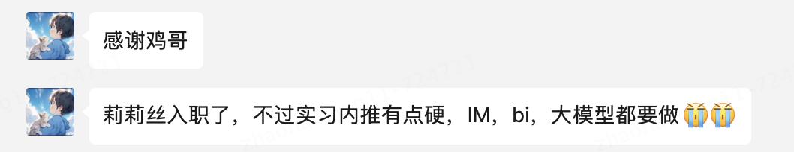

# 莉莉丝-25届-正式岗

# 背景信息
工作年限：25 应届

公司：莉莉丝

面试轮次：3 轮面试

# 面试真题
1.自我介绍

2.实习经历

3.go语言了解多少

4.go语言与Java有什么区别？

5.go开发的框架有了解多少？(gin还有gorm)

6.gin和gorm对应了Java中那些框架(gin对应springboot，gorm对应mybatis，不过我这里说与其说mybatis，不如说mybatisplus)

7.mybatisplus与mybatis的区别？

8.mybatis为什么更加灵活？(动态sql)

9.说到动态sql，你感觉gorm那个怎么样？

10.你上面说go语言和Java的区别，有说到协程，协程与线程有什么区别？

11.Java里面有协程吗？(有的，Java21推出了虚拟线程，这就是对应go里面的协程，然后我提到了Java22可以创建无限制的虚拟线程)

12.协程会更加轻量，怎么个轻量法？

13.说说协程的优点和缺点

14.说一下协程的作用？(本质上和线程差不多)

15.你说到了异步，说一下异步场景(结合项目)

16.说一下锁机制，以及死锁

17.聊一下锁的使用场景？(聊到缓存击穿)

18.说说缓存击穿怎么解决？(我主要从组件角度去说)

19.双重判断锁说说

20.你说到了单例模式，简单说说单例模式

21.询问一下sql情况

22.询问一下亚马逊生成式ai

反问:

1.前面说到了异步的场景，你说bi处理千万级别的数据可能处理方式有哪些？

2.面试有几轮？

最后他问了一下能到岗的

# 后续

# 鸣谢
感谢网友 答案哥 小伙伴的贡献，以上为真实面经，无剧本，如有质疑，可发红包对赌真假。

> 原文: <https://www.yuque.com/jingdianjichi/xyxdsi/hd7hd676i1gvoguv>