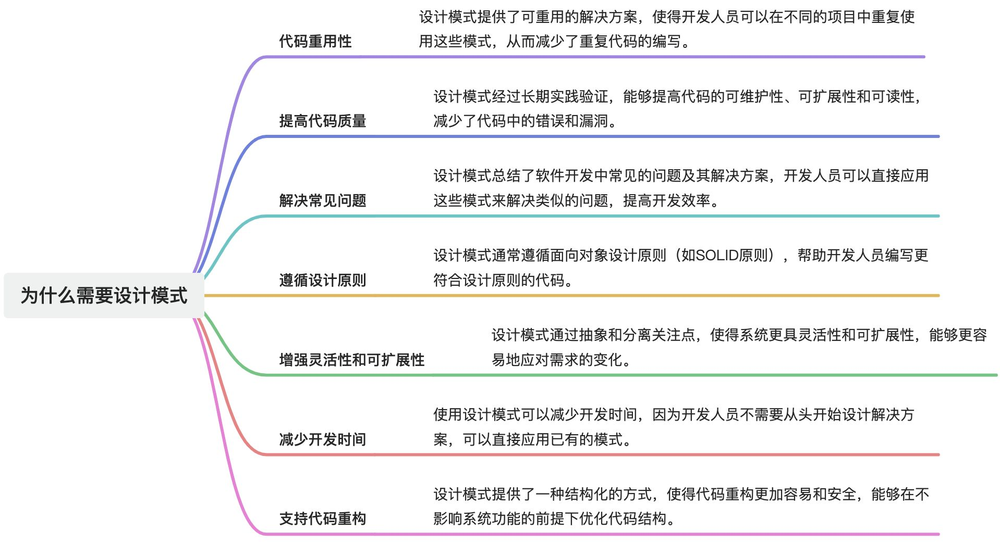

# 什么是设计模式？为什么需要设计模式？

# 题目详细答案
## 什么是设计模式？
设计模式（Design Patterns）是软件开发中被反复使用的、经过验证的、解决特定问题的代码结构和设计方法。设计模式提供了一种标准化的解决方案，用于应对面向对象软件设计中的常见问题。它们通常以模板的形式描述，包含了在特定情境下如何解决某类问题的最佳实践。

## 为什么需要设计模式？

> 原文: <https://www.yuque.com/jingdianjichi/xyxdsi/koi573uleufat2y4>